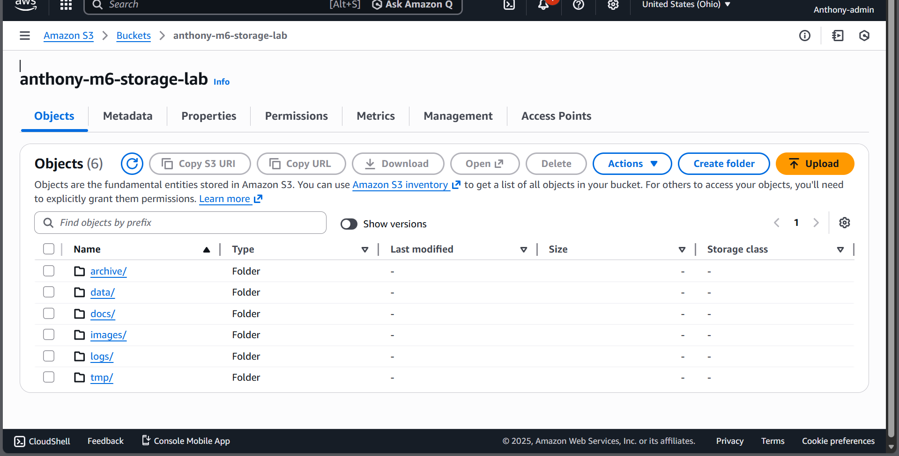
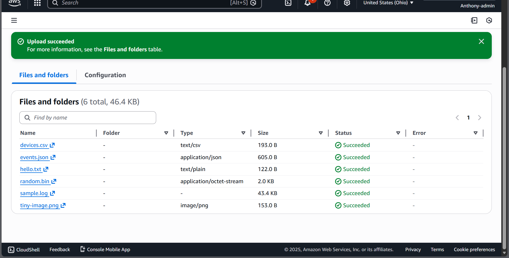
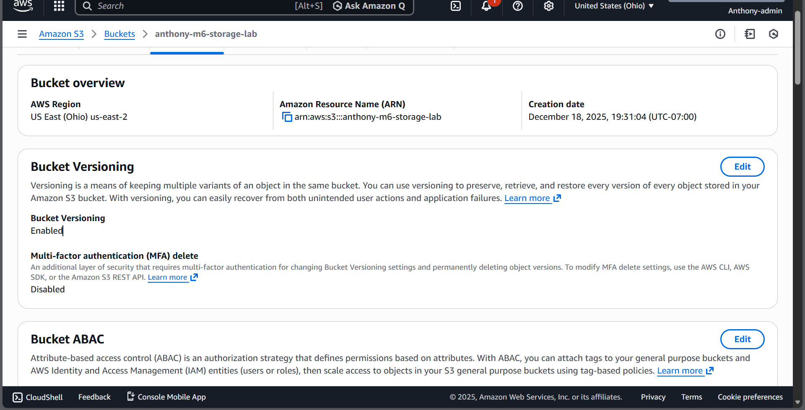
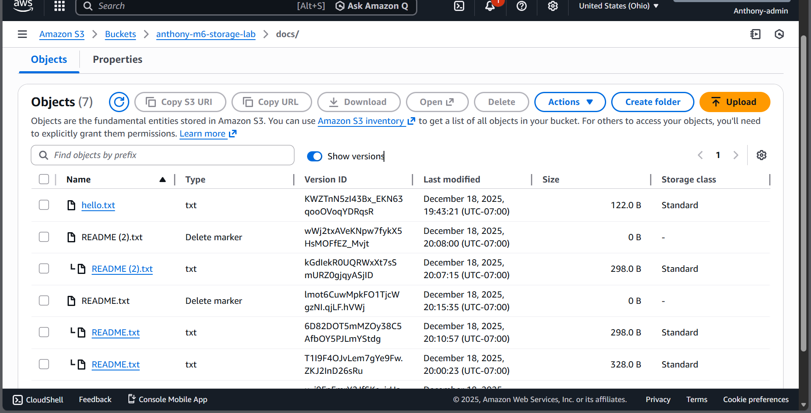
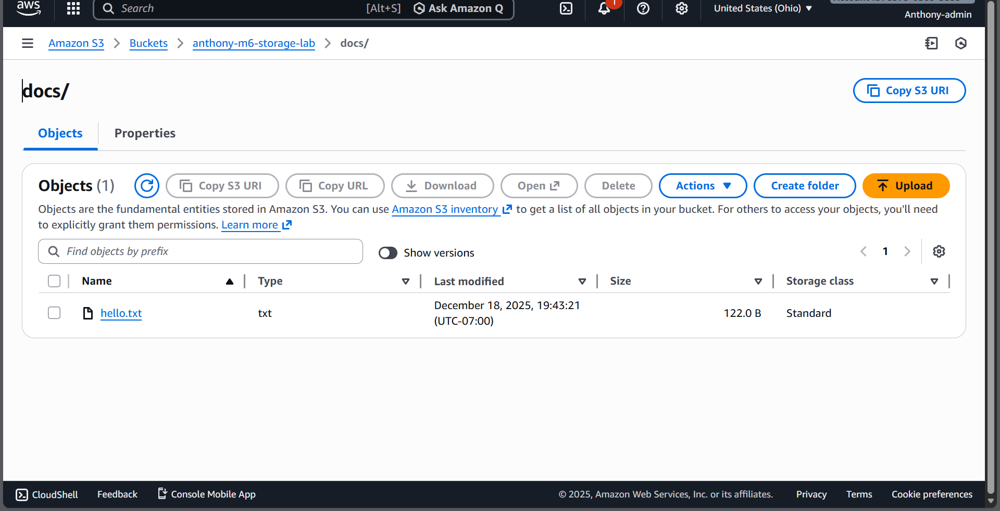

# Module 6 — S3 Storage Lab (Console)

## Objective
Practice core Amazon S3 skills:
- Create a bucket
- Upload objects and organize using prefixes (folders)
- Create a simple “pro move” structure
- Enable and verify versioning behavior (delete markers + object versions)
- Clean up objects safely

## Environment
- AWS Region: us-east-2 (Ohio)
- Bucket: anthony-m6-storage-lab
- Tools: AWS Console

## What I built
A simple S3 bucket organized by prefixes:
- data/    (datasets like CSV/JSON)
- docs/    (documentation + small text files)
- images/  (image assets)
- logs/    (log files)
- tmp/     (temporary uploads; safe to delete)
- archive/ (older reference files)

## Steps completed
1) Created the S3 bucket
2) Uploaded test objects (csv/json/txt/png/log/bin)
3) Created prefix structure (data, docs, images, logs, tmp, archive)
4) Uploaded README.txt into docs/
5) Verified Bucket Versioning = Enabled
6) Demonstrated version history by re-uploading/renaming README (multiple versions)
7) Demonstrated deletion behavior (delete marker)
8) Performed a **full delete** by enabling “Show versions” and deleting versions + delete marker

## Results
- Bucket created in us-east-2 with versioning enabled
- Objects organized using prefixes
- Verified version history + delete marker behavior
- Successfully performed a full delete (versions + delete marker)

## Evidence (Screenshots)

1. Bucket / prefix structure (top-level folders)
   

2. Upload succeeded (objects uploaded)
   

3. Prefix structure view (detail)
   

4. Bucket Versioning enabled (Properties tab)
   

5. docs/ with Show versions ON (versions + delete marker)
   

6. docs/ with Show versions OFF (final clean view)
   

7. Bonus — After recovery clean (optional)
   

> Tip: blur account ID in the top right if visible.

## Key takeaways
- “Folders” in S3 are really **prefixes**, not real directories.
- With versioning on:
  - Deleting an object creates a **delete marker** (object looks deleted in normal view)
  - The data may still exist as prior versions unless you delete the versions.
- To **fully delete**, turn on **Show versions** and delete:
  - the object versions, and
  - the delete marker

## Cleanup checklist
- [ ] Delete test objects (including versions if enabled)
- [ ] Empty bucket
- [ ] Delete bucket to avoid ongoing charges (if this was lab-only)
